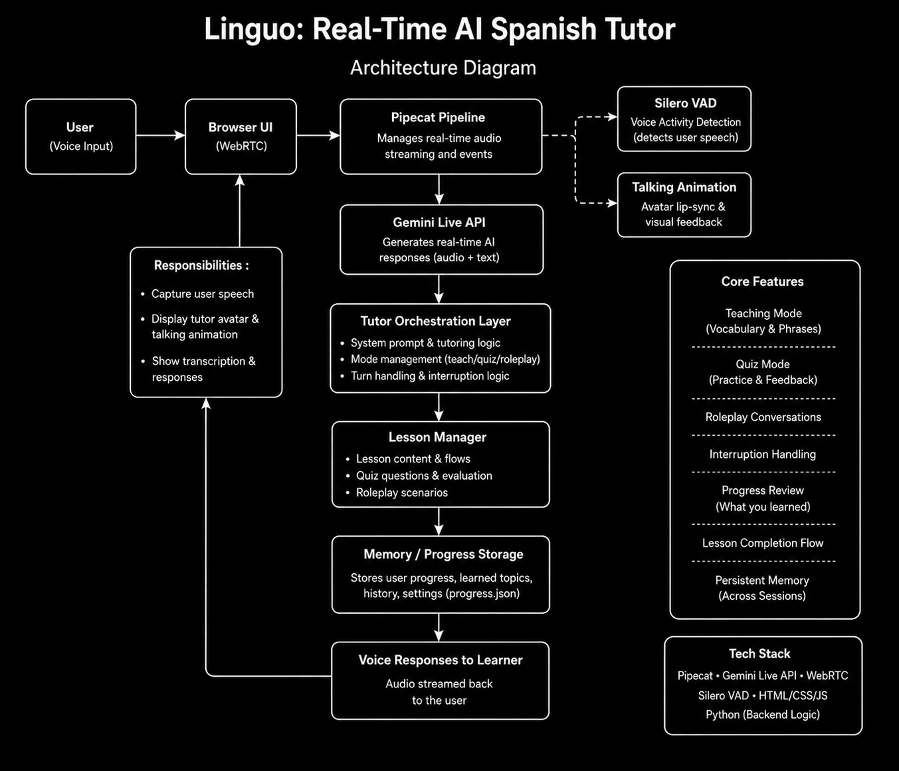

# Linguo: Real-Time AI Spanish Tutor

A voice-first, real-time AI Spanish tutor built using Pipecat and the Gemini Live API.

Linguo is designed to simulate a natural conversational language-learning experience through low-latency spoken interaction, interruption handling, roleplay conversations, and adaptive tutoring flows.

---

## Demo

🎥 Demo Video: *Add your demo video link here*

---

## Features

### Real-Time Voice Tutoring

* Streaming conversational interaction using voice input and output
* Low-latency spoken responses
* Natural conversational pacing

### Teaching Mode

Structured Spanish lessons including:

* Greetings
* Numbers
* Ordering Food / Coffee

### Quiz Mode

* Conversational verbal quizzes
* Corrective feedback
* Semantic answer tolerance
* Pronunciation mistake tolerance

### Roleplay Conversations

Practice real-world scenarios such as:

* Ordering coffee
* Ordering food
* Conversational interaction with contextual corrections

### Interruption Handling

Supports natural conversational interruptions:

* Ask doubts mid-lesson
* Switch topics dynamically
* Resume previous conversational context naturally

### Progress Review

The tutor can summarize previously practiced topics and vocabulary during the session.

### Persistent Memory

Lightweight persistence using JSON storage:

* Completed lessons
* Vocabulary exposure
* Session progress

---

## System Architecture



### High-Level Flow

User Voice Input
→ Browser UI (WebRTC)
→ Pipecat Real-Time Pipeline
→ Silero VAD
→ Gemini Live API
→ Tutor Orchestration Logic
→ Lesson / Quiz Manager
→ Memory Layer (`progress.json`)
→ Streaming Voice Response Back to User

---

## Tech Stack

### Orchestration

* Pipecat

### LLM

* Gemini Live API

### Voice Activity Detection

* Silero VAD

### Frontend

* HTML / CSS / JavaScript
* WebRTC

### Backend

* Python

### Persistence

* JSON (`progress.json`)

---

## Repository Structure

```text
linguo-spanish-tutor/
│
├── client/                  # Frontend UI
├── server/                  # Pipecat backend pipeline
├── TECHNICAL_WRITEUP.md     # Detailed technical documentation
├── architecture.png         # Architecture diagram
├── README.md
└── .env.example
```

---

## Setup Instructions

### 1. Clone Repository

```bash
git clone <your-repo-url>
cd linguo-spanish-tutor
```

### 2. Install Dependencies

```bash
uv sync
```

### 3. Configure Environment Variables

Create a `.env` file:

```env
GEMINI_API_KEY=your_api_key_here
```

---

## Running the Application

### Start Backend

```bash
uv run bot-gemini.py
```

### Start Frontend

Open the browser client locally and connect to the Pipecat pipeline.

---

## Assignment Requirements Covered

* Real-time voice tutoring
* Quiz mode
* Roleplay conversations
* Interruption handling
* Code-switching tolerance
* Persistent memory
* Voice-first conversational UX
* Pipecat-based orchestration
* Gemini Live integration

---

## Technical Writeup

Detailed implementation notes, tradeoffs, architecture decisions, latency observations, and challenges are available in:

📄 `TECHNICAL_WRITEUP.md`

---

## Challenges Faced

Some of the major engineering challenges during development included:

* Real-time interruption handling
* Conversational continuity
* Speech recognition noise tolerance
* Balancing flexibility vs deterministic orchestration
* Low-latency conversational UX

---

## Future Improvements

Potential future enhancements include:

* Pronunciation scoring
* Adaptive curriculum difficulty
* Better semantic quiz grading
* Spaced repetition systems
* Multi-language support
* Enhanced analytics and observability

---

## AI Assistance Disclosure

AI assistants such as ChatGPT and Claude were used selectively during development for debugging support, prompt iteration, documentation refinement, and architectural brainstorming.

All core implementation decisions, orchestration design, integration, testing, behavioral tuning, and final system validation were manually reviewed, iterated upon, and validated during development.

---

## Author

Sanjana Kumari
IIT Graduate
AI Engineer Assignment Submission
